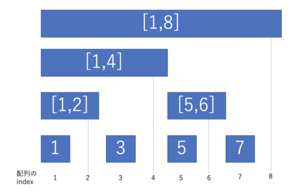

# BIT(Binary Indexed Tree)
別名: Fenwick Tree フェニック木  
セグメント木が任意の区間話を求めることができた構造だったのに対し、BITでは、**最初から i 番目までの区間和**をセグメント木より効率的に求める。

## 実装例(和を求める場合)
```cpp
class BIT {
public:
    // 大きさだけで初期化する場合
    explicit BIT(size_t size) : m_bit(size + 1) {}
    // 数列で初期化する場合
    explicit BIT(const vector<ll> &v) : BIT(v.size()) {
        for (int i = 0; i < v.size(); ++i) {
            add((i + 1), v[i]);
        }
    }
    // 閉区間 [1, r) の合計を返す
    ll sum(int r) {
        ll ret = 0;
        for (; 0 < r; r -= (r & -r)) {
            ret += m_bit[r];
        }
        return ret;
    }
    // 閉区間 [l, r) の合計を返す
    ll sum(int l, int r) {
        // 累積和の計算と同じ
        return (sum(r) - sum(l - 1));
    }
    // i 番目の要素を加算
    void add(int idx, ll value) {
        for (; idx < m_bit.size(); idx += (idx & -idx)) {
            m_bit[idx] += value;
        }
    }

private:
    vector<ll> m_bit;
};
```

## indexの扱いがポイント
画像のように対応する範囲(閉区間)の和を下の対応するindexにて格納しておく。
  
### 値の更新
例として3番目の値を更新する。  
3番目の値を更新する際に影響するのは、`3, [1, 4], [1, 8]` に格納されている値。  
それぞれの区間に対応するindex は 3($(0011)_2$) => 4($(0100)_2$) => 8($(1000)_2$)  
**この遷移は `index += (index & -index)`とすることで進められる！！**  

**`index & -index`は、indexの最後の1ビット(最下位ビット)を求めている。**
遷移ごとに最下位ビットを加算していることが上の例からもわかる。  

$
0011 + 0001 = 0100 \\
0100 + 0100 = 1000 \\
1000 + 1000 = 0000 
$


### 値の取り出し
例として、7番目までの和を取り出す。  
7番目までの和を取り出すには、BITにおいて、`7, [5, 6], [1, 4]`の和を取ることで得られる。  
それぞれの区間に対応するindex は 4($(0111)_2$) => 6($(0110)_2$) => 4($(0100)_2$)  
**この遷移は `index -= (index & -index)`とすることで進められる！！**  

$
0111 - 0001 = 0110 \\
0110 - 0010 = 0100 \\
0100 - 0100 = 0000
$

※ 1 始まりのindex(1-indexed)なので注意。  
※ 画像の、空白の部分も埋めて扱う構造が、セグメント木。


### [DPまとめコンテスト Q - Flowers](https://atcoder.jp/contests/dp/tasks/dp_q)
```cpp
#include <bits/stdc++.h>
using namespace std;
#include <atcoder/all>
using namespace atcoder;
/* alias */
using ll = long long;
using vi = vector<int>;
using pii = pair<int, int>;

class BIT_max {
public:
    // 大きさだけで初期化する場合
    explicit BIT_max(size_t size) : m_bit(size + 1) {}
    // 閉区間 [1, r) の合計を返す
    ll get_max(int r) {
        ll ret = 0;
        for (; 0 < r; r -= (r & -r)) {
            ret = max(ret, m_bit[r]);
        }
        return ret;
    }
    // i 番目の要素を加算
    void set_val(int idx, ll value) {
        for (; idx < m_bit.size(); idx += (idx & -idx)) {
            m_bit[idx] = max(m_bit[idx], value);
        }
    }

private:
    vector<ll> m_bit;
};

int N, h[200009], a[200009];
// i番目の花を残すとき、iより左の花の美しさの最大値
ll dp[200009];

int main() {
    cin >> N;
    vector<pii> flowers;
    for (int i = 1; i <= N; i++) {
        cin >> h[i];
        flowers.push_back(pii(h[i], i));
    }
    for (int i = 1; i <= N; i++)
        cin >> a[i];

    // h が小さい順に並び替え、BIT(Binary Indexed Tree)を使うことで計算量を削減する
    ll ans = 0;
    sort(flowers.begin(), flowers.end());
    BIT_max bit_max(N + 1);
    for (auto p : flowers) {
        int i = p.second;
        dp[i] = bit_max.get_max(i) + a[i];
        bit_max.set_val(i, dp[i]);
        ans = max(ans, dp[i]);
    }

    cout << ans << endl;
    return 0;
}
```

### 参考
- [Binary Indexed Tree (BIT) 総まとめ！区間加算や二次元BITまで](https://algo-logic.info/binary-indexed-tree/)